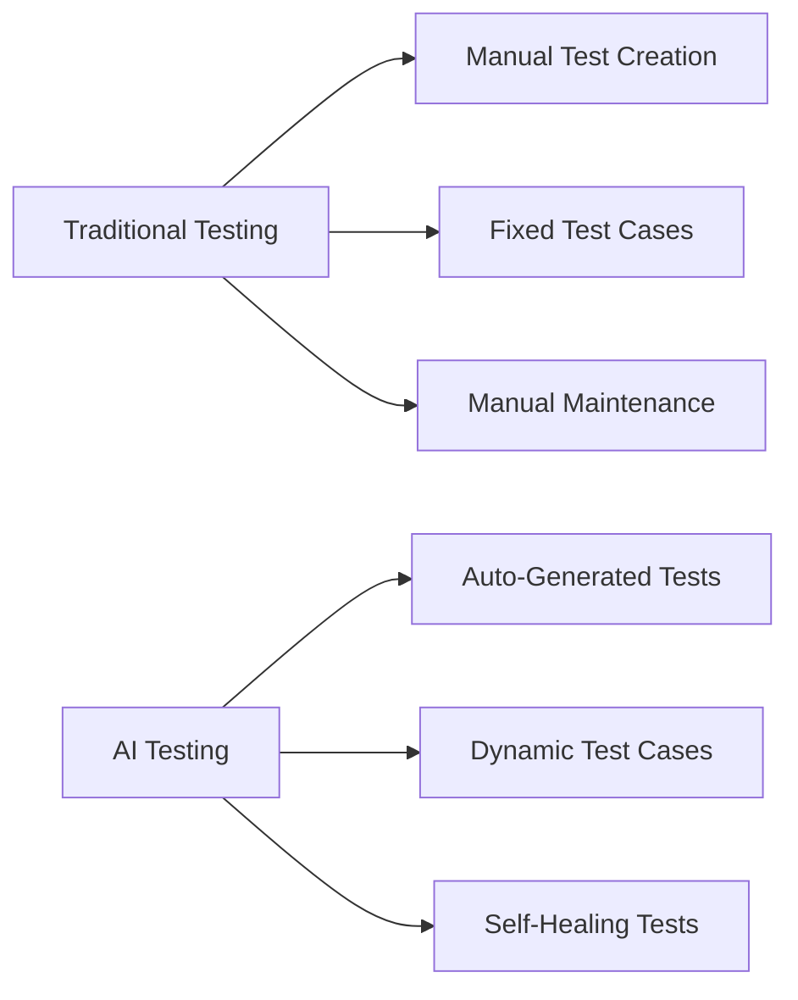

# AI-Powered DevOps: Transforming Software Delivery

Artificial Intelligence is revolutionizing DevOps practices, enabling more intelligent automation, predictive analytics, and enhanced decision-making. Let's explore how AI is transforming various aspects of the DevOps lifecycle.

## Key Areas of AI Integration

1. **Automated Testing**
2. **Intelligent Monitoring**
3. **Predictive Analytics**
4. **Code Quality Analysis**
5. **Release Management**

## Automated Testing with AI

### Traditional vs AI-Powered Testing



### Implementation Example

```python
from ai_test_generator import TestGenerator
from model_trainer import ModelTrainer

class AITestFramework:
    def __init__(self):
        self.test_generator = TestGenerator()
        self.model = ModelTrainer()

    def generate_tests(self, codebase_path):
        # Analyze codebase and generate relevant tests
        test_cases = self.test_generator.analyze_and_generate(codebase_path)
        
        # Train model on historical test results
        self.model.train(test_cases)
        
        return test_cases

    def predict_test_priority(self, changes):
        # Predict which tests are most likely to fail
        return self.model.predict_priority(changes)
```

## Intelligent Monitoring

### Setting Up AI-Powered Monitoring

```yaml
monitoring:
  ai_components:
    - name: anomaly_detection
      type: isolation_forest
      config:
        sensitivity: 0.95
        training_period: 7d
    
    - name: root_cause_analysis
      type: causal_inference
      config:
        confidence_threshold: 0.8
        max_depth: 5
```

### Anomaly Detection Model

```python
from sklearn.ensemble import IsolationForest
import numpy as np

class AnomalyDetector:
    def __init__(self):
        self.model = IsolationForest(
            contamination=0.05,
            random_state=42
        )

    def train(self, metrics_data):
        self.model.fit(metrics_data)

    def detect_anomalies(self, current_metrics):
        predictions = self.model.predict(current_metrics)
        return np.where(predictions == -1)[0]
```

## Predictive Analytics for Capacity Planning

### Resource Prediction Model

```python
import tensorflow as tf

def build_lstm_model():
    model = tf.keras.Sequential([
        tf.keras.layers.LSTM(64, input_shape=(24, 7)),  # 24 hours, 7 metrics
        tf.keras.layers.Dense(32, activation='relu'),
        tf.keras.layers.Dense(1)
    ])
    
    model.compile(
        optimizer='adam',
        loss='mse',
        metrics=['mae']
    )
    
    return model
```

## Code Quality Analysis

### AI-Powered Code Review

```python
class AICodeReviewer:
    def analyze_code(self, code_diff):
        # Analyze code changes for potential issues
        security_issues = self.check_security_vulnerabilities(code_diff)
        performance_issues = self.analyze_performance_impact(code_diff)
        best_practices = self.check_best_practices(code_diff)
        
        return {
            'security': security_issues,
            'performance': performance_issues,
            'best_practices': best_practices
        }

    def suggest_improvements(self, analysis):
        # Generate improvement suggestions based on analysis
        return self.model.generate_suggestions(analysis)
```

## Release Management

### Risk Assessment Model

```python
class ReleaseRiskAssessor:
    def assess_risk(self, release_data):
        risk_factors = {
            'code_churn': self.analyze_code_changes(),
            'test_coverage': self.check_test_coverage(),
            'deployment_history': self.analyze_past_deployments(),
            'system_stability': self.check_system_metrics()
        }
        
        return self.model.predict_risk(risk_factors)
```

## Implementation Strategy

1. **Start Small**
   - Begin with one area (e.g., monitoring)
   - Collect baseline metrics
   - Gradually expand scope

2. **Data Collection**
   - System metrics
   - Deployment logs
   - Test results
   - User feedback

3. **Model Training**
   - Historical incident data
   - Performance metrics
   - Code quality metrics
   - Deployment outcomes

## Results from Our Implementation

After implementing AI in our DevOps pipeline:

- 45% reduction in false positive alerts
- 60% faster incident resolution
- 30% improvement in test coverage
- 25% reduction in deployment failures

## Challenges and Solutions

### 1. Data Quality

**Challenge**: Inconsistent and noisy data
**Solution**: 
```python
def clean_metrics_data(data):
    # Remove outliers
    z_scores = stats.zscore(data)
    clean_data = data[abs(z_scores) < 3]
    
    # Handle missing values
    clean_data = clean_data.interpolate(method='time')
    
    return clean_data
```

### 2. Model Accuracy

**Challenge**: False positives in anomaly detection
**Solution**: 
```python
def adaptive_thresholding(metrics, window_size=24):
    threshold = metrics.rolling(window=window_size).mean() + \
               2 * metrics.rolling(window=window_size).std()
    return threshold
```

## Future Developments

1. **AutoML for DevOps**
   - Automated model selection
   - Hyperparameter optimization
   - Continuous model retraining

2. **Natural Language DevOps**
   - Intent-based automation
   - Natural language queries
   - Automated documentation

## Best Practices

1. **Model Monitoring**
   ```python
   def monitor_model_performance(model, actual_results):
       predictions = model.predict(test_data)
       accuracy = calculate_accuracy(predictions, actual_results)
       
       if accuracy < THRESHOLD:
           trigger_model_retraining()
   ```

2. **Feedback Loops**
   ```python
   class FeedbackCollector:
       def collect_feedback(self, prediction, actual):
           self.feedback_data.append({
               'prediction': prediction,
               'actual': actual,
               'timestamp': datetime.now()
           })
           
           if len(self.feedback_data) >= BATCH_SIZE:
               self.update_model()
   ```

## Resources

- [MLOps Best Practices](https://ml-ops.org/)
- [DevOps AI Integration Guide](https://devops.ai/guide)
- [TensorFlow for DevOps](https://tensorflow.org/devops)
- [Scikit-learn Documentation](https://scikit-learn.org/) 