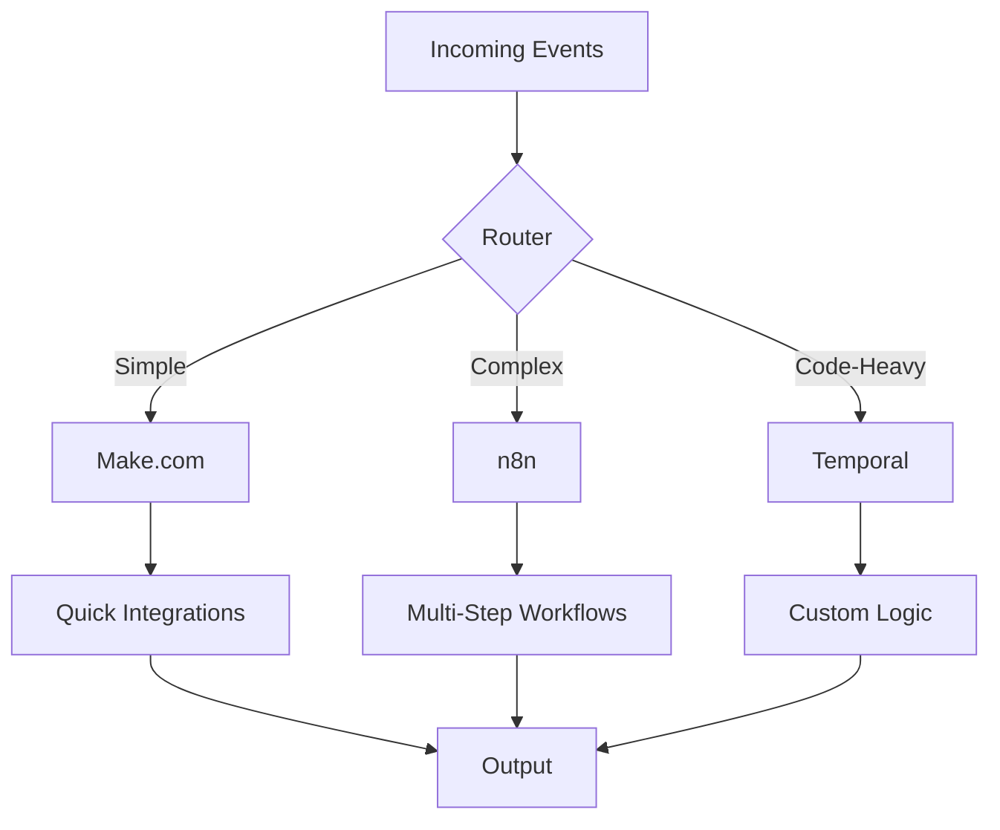

# From Zapier to Make.com to n8n: Building Cost-Effective Automation Pipelines

When our Zapier bill hit $2,000/month for basic integrations, we knew something had to change. This is our journey through different automation platforms and how we built a hybrid solution saving us $20,000 annually.

## The Automation Evolution

### Phase 1: The Zapier Days (Expensive but Easy)

```javascript
// What we were doing in Zapier
Trigger: Webhook received
Action 1: Parse JSON
Action 2: Query Database
Action 3: Send to Slack
Action 4: Update Spreadsheet
Action 5: Send Email

Cost: $0.05 per execution × 40,000 runs = $2,000/month
```

### Phase 2: Discovering Make.com (Formerly Integromat)

Make.com changed the game with visual programming and fair pricing:

```json
// Make.com scenario example
{
  "name": "Customer Onboarding Pipeline",
  "trigger": {
    "type": "webhook",
    "instant": true
  },
  "modules": [
    {
      "name": "Parse Customer Data",
      "type": "json",
      "mapping": {
        "email": "{{1.email}}",
        "plan": "{{1.subscription.plan}}",
        "company": "{{1.company}}"
      }
    },
    {
      "name": "Create in CRM",
      "type": "http",
      "method": "POST",
      "url": "https://api.crm.com/customers",
      "headers": {
        "Authorization": "Bearer {{connection.api_key}}"
      }
    }
  ]
}
```

## Make.com Deep Dive

### Real-World Implementation: Multi-Stage Data Pipeline

```javascript
// Scenario: Process customer feedback from multiple sources
// Make.com Blueprint (exported)

{
  "blueprint": {
    "modules": [
      {
        // Module 1: Webhook Trigger
        "id": 1,
        "module": "gateway:CustomWebHook",
        "metadata": {
          "name": "Feedback Webhook",
          "expect": ["email", "feedback", "source", "rating"]
        }
      },
      {
        // Module 2: Data Enrichment
        "id": 2,
        "module": "http:ActionSendData",
        "parameters": {
          "url": "https://api.clearbit.com/v2/people/find",
          "method": "GET",
          "qs": {
            "email": "{{1.email}}"
          }
        },
        "mapper": {
          "company": "{{response.company.name}}",
          "role": "{{response.role}}",
          "seniority": "{{response.seniority}}"
        }
      },
      {
        // Module 3: Sentiment Analysis
        "id": 3,
        "module": "openai:CreateCompletion",
        "parameters": {
          "model": "gpt-3.5-turbo",
          "messages": [{
            "role": "system",
            "content": "Analyze sentiment and extract key topics"
          }, {
            "role": "user",
            "content": "{{1.feedback}}"
          }]
        }
      },
      {
        // Module 4: Router for Priority
        "id": 4,
        "module": "builtin:BasicRouter",
        "routes": [
          {
            "condition": "{{1.rating <= 2 OR 3.sentiment == 'negative'}}",
            "modules": [/* Alert modules */]
          },
          {
            "condition": "{{2.seniority == 'executive'}}",
            "modules": [/* Executive track modules */]
          }
        ]
      }
    ]
  }
}
```

### Advanced Make.com Patterns

#### 1. Error Handling with Rollback
```javascript
// Implementing transaction-like behavior
{
  "errorHandler": {
    "type": "rollback",
    "modules": [
      {
        "name": "Revert Database",
        "condition": "{{error.module}} == 'database_insert'"
      },
      {
        "name": "Send Alert",
        "type": "email",
        "to": "devops@company.com",
        "subject": "Pipeline Failed: {{error.message}}"
      }
    ]
  }
}
```

#### 2. Complex Data Transformations
```javascript
// Using Make.com's built-in functions
{
  "transformer": {
    "customerData": {
      "id": "{{uuid()}}",
      "timestamp": "{{now()}}",
      "formattedDate": "{{formatDate(1.date; 'YYYY-MM-DD')}}",
      "scoreCategory": "{{switch(1.score; 
        0-3; 'detractor';
        4-6; 'passive';
        7-10; 'promoter'
      )}}",
      "tags": "{{split(1.feedback; ' ') | unique | join(', ')}}"
    }
  }
}
```

### Make.com Cost Optimization

```javascript
// Optimizing operations usage
const optimizationStrategies = {
  
  // 1. Batch Processing
  batchWebhooks: {
    before: "1 webhook = 1 scenario run",
    after: "Collect 100 webhooks, process as 1 run",
    savings: "99% operation reduction"
  },
  
  // 2. Smart Filtering
  earlyFiltering: {
    before: "Process all → Filter at end",
    after: "Filter immediately after trigger",
    savings: "60% operation reduction"
  },
  
  // 3. Data Store Caching
  caching: {
    implementation: `
      if (datastore.get('cache_key')) {
        return cached_value;  // 1 operation
      } else {
        value = expensive_api_call();  // 3 operations
        datastore.set('cache_key', value, ttl=3600);
        return value;
      }
    `,
    savings: "75% for repeated lookups"
  }
};
```

## Enter n8n: Self-Hosted Powerhouse

When we needed more control and complex workflows, n8n became our go-to:

### n8n Workflow Example: ML Pipeline Automation

```typescript
// n8n Workflow Code (programmatic definition)
import {
  INodeType,
  INodeTypeDescription,
  IExecuteFunctions,
  INodeExecutionData,
} from 'n8n-workflow';

export class MLPipelineAutomation implements INodeType {
  description: INodeTypeDescription = {
    displayName: 'ML Pipeline Orchestrator',
    name: 'mlPipelineOrchestrator',
    group: ['transform'],
    version: 1,
    description: 'Orchestrate ML training pipelines',
    defaults: {
      name: 'ML Pipeline',
    },
    inputs: ['main'],
    outputs: ['main'],
    properties: [
      {
        displayName: 'Pipeline Stage',
        name: 'stage',
        type: 'options',
        options: [
          { name: 'Data Preparation', value: 'prep' },
          { name: 'Training', value: 'train' },
          { name: 'Evaluation', value: 'eval' },
          { name: 'Deployment', value: 'deploy' },
        ],
        default: 'prep',
      },
    ],
  };

  async execute(this: IExecuteFunctions): Promise<INodeExecutionData[][]> {
    const items = this.getInputData();
    const stage = this.getNodeParameter('stage', 0) as string;
    
    const returnData: INodeExecutionData[] = [];
    
    for (let i = 0; i < items.length; i++) {
      const item = items[i];
      
      switch (stage) {
        case 'prep':
          // Trigger data preparation
          const prepResult = await this.helpers.httpRequest({
            method: 'POST',
            url: 'http://mlflow:5000/api/2.0/jobs/run-now',
            body: {
              job_id: process.env.PREP_JOB_ID,
              parameters: item.json
            }
          });
          
          returnData.push({
            json: {
              stage: 'prep',
              runId: prepResult.run_id,
              status: 'initiated'
            }
          });
          break;
          
        case 'train':
          // Trigger model training
          const trainResult = await this.helpers.httpRequest({
            method: 'POST',
            url: 'http://kubeflow:8080/apis/v1beta1/experiments',
            body: {
              name: `training-${Date.now()}`,
              spec: {
                algorithm: item.json.algorithm,
                parameters: item.json.hyperparameters
              }
            }
          });
          
          returnData.push({
            json: {
              stage: 'train',
              experimentId: trainResult.id,
              status: 'running'
            }
          });
          break;
      }
    }
    
    return [returnData];
  }
}
```

### n8n Production Setup

```yaml
# docker-compose.yml for n8n with PostgreSQL
version: '3.8'

services:
  postgres:
    image: postgres:15
    environment:
      POSTGRES_DB: n8n
      POSTGRES_USER: n8n
      POSTGRES_PASSWORD: ${POSTGRES_PASSWORD}
    volumes:
      - postgres-data:/var/lib/postgresql/data
    healthcheck:
      test: ["CMD-SHELL", "pg_isready -U n8n"]
      interval: 10s
      timeout: 5s
      retries: 5

  n8n:
    image: n8nio/n8n:latest
    environment:
      - DB_TYPE=postgresdb
      - DB_POSTGRESDB_HOST=postgres
      - DB_POSTGRESDB_DATABASE=n8n
      - DB_POSTGRESDB_USER=n8n
      - DB_POSTGRESDB_PASSWORD=${POSTGRES_PASSWORD}
      - N8N_BASIC_AUTH_ACTIVE=true
      - N8N_BASIC_AUTH_USER=${N8N_USER}
      - N8N_BASIC_AUTH_PASSWORD=${N8N_PASSWORD}
      - N8N_ENCRYPTION_KEY=${N8N_ENCRYPTION_KEY}
      - WEBHOOK_URL=https://automation.company.com/
      - EXECUTIONS_DATA_PRUNE=true
      - EXECUTIONS_DATA_MAX_AGE=168  # 7 days
    ports:
      - "5678:5678"
    volumes:
      - n8n-data:/home/node/.n8n
      - ./custom-nodes:/home/node/.n8n/custom
    depends_on:
      postgres:
        condition: service_healthy

  redis:
    image: redis:7-alpine
    command: redis-server --appendonly yes
    volumes:
      - redis-data:/data

volumes:
  postgres-data:
  n8n-data:
  redis-data:
```

## Platform Comparison: Real Numbers

```python
# Cost analysis over 6 months
platforms = {
    "Zapier": {
        "monthly_cost": 2000,
        "operations_limit": 100000,
        "cost_per_1k_ops": 20,
        "ease_of_use": 5,
        "flexibility": 3,
        "self_hosted": False
    },
    "Make.com": {
        "monthly_cost": 299,  # Pro plan
        "operations_limit": 800000,
        "cost_per_1k_ops": 0.37,
        "ease_of_use": 4,
        "flexibility": 4,
        "self_hosted": False
    },
    "n8n": {
        "monthly_cost": 150,  # Infrastructure only
        "operations_limit": "unlimited",
        "cost_per_1k_ops": 0,
        "ease_of_use": 3,
        "flexibility": 5,
        "self_hosted": True
    },
    "Temporal": {
        "monthly_cost": 500,  # Cloud or self-hosted
        "operations_limit": "unlimited",
        "cost_per_1k_ops": 0,
        "ease_of_use": 2,
        "flexibility": 5,
        "self_hosted": True
    }
}
```

## Our Hybrid Architecture



### Implementation Strategy

```python
# Decision matrix for platform selection
def select_automation_platform(workflow):
    if workflow.steps < 5 and workflow.all_saas:
        return "Make.com"  # Visual, simple
    
    elif workflow.needs_custom_code or workflow.complex_logic:
        return "n8n"  # Flexible, self-hosted
    
    elif workflow.long_running or workflow.needs_reliability:
        return "Temporal"  # Code-first, bulletproof
    
    else:
        return "Custom"  # Build it yourself
```

## Best Practices We Learned

### 1. Webhook Management
```javascript
// Centralized webhook receiver
const webhookRouter = {
  async handleWebhook(req, res) {
    const { source, type, data } = req.body;
    
    // Log everything
    await logger.info('webhook_received', {
      source,
      type,
      timestamp: new Date().toISOString(),
      data_size: JSON.stringify(data).length
    });
    
    // Route to appropriate platform
    switch(classifyComplexity(data)) {
      case 'simple':
        await forwardToMake(data);
        break;
      case 'complex':
        await queueForN8n(data);
        break;
      case 'critical':
        await triggerTemporal(data);
        break;
    }
    
    res.status(200).send('Acknowledged');
  }
};
```

### 2. Error Handling Across Platforms
```typescript
// Unified error handling
interface AutomationError {
  platform: 'make' | 'n8n' | 'temporal';
  workflow_id: string;
  error_type: string;
  retry_count: number;
  next_retry: Date;
}

class AutomationErrorHandler {
  async handle(error: AutomationError) {
    // Log to centralized system
    await this.logError(error);
    
    // Platform-specific retry logic
    if (error.retry_count < 3) {
      await this.scheduleRetry(error);
    } else {
      await this.escalate(error);
    }
  }
}
```

## Cost Savings Achieved

```
Before:
- Zapier: $2,000/month
- Manual processes: 40 hours/month × $50 = $2,000
- Total: $4,000/month

After:
- Make.com: $299/month
- n8n infrastructure: $150/month
- Maintenance: 5 hours/month × $50 = $250
- Total: $699/month

Savings: $3,301/month (82.5% reduction)
Annual savings: $39,612
```

## Conclusion

The key to cost-effective automation isn't choosing one platform—it's using the right tool for each job. Our hybrid approach gives us:

1. **Make.com** for rapid prototyping and simple integrations
2. **n8n** for complex workflows requiring custom logic
3. **Temporal** for mission-critical, long-running processes

Start with Make.com, graduate to n8n when you need more control, and keep Temporal in your back pocket for the heavy lifting.

---

*Want to discuss automation strategies? Connect with me on [LinkedIn](https://linkedin.com/in/subrahmanyakp)*