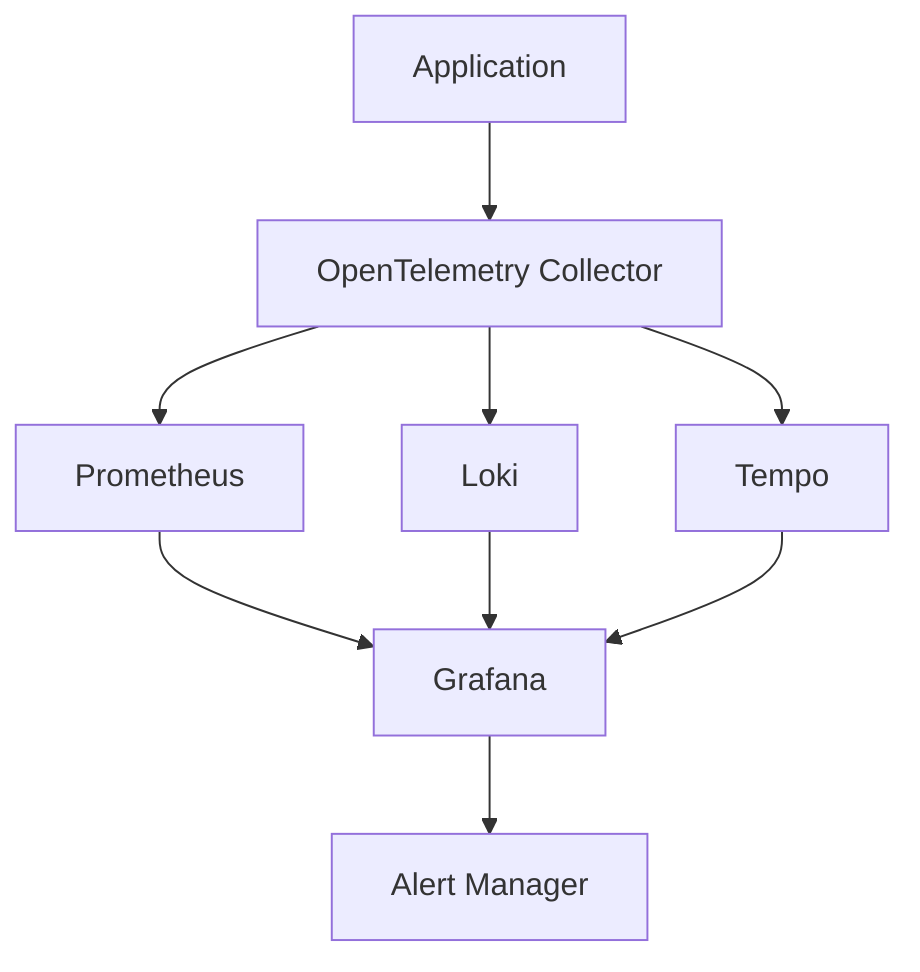

# Building a Modern Observability Platform: An SRE's Guide

As systems become more complex and distributed, observability has become a critical aspect of maintaining reliable services. In this guide, I'll share my experience building a comprehensive observability platform that helped reduce MTTR by 70% and improved overall system reliability.

## The Three Pillars of Observability

Before diving into implementation, let's understand the three pillars:

1. **Metrics**: Numerical measurements over time
2. **Logs**: Detailed event records
3. **Traces**: Request flows through distributed systems

## Architecture Overview

Our observability stack consists of:



## Setting Up Metrics Collection

First, let's configure Prometheus for metrics collection:

```yaml
global:
  scrape_interval: 15s
  evaluation_interval: 15s

scrape_configs:
  - job_name: 'kubernetes-pods'
    kubernetes_sd_configs:
      - role: pod
    relabel_configs:
      - source_labels: [__meta_kubernetes_pod_annotation_prometheus_io_scrape]
        action: keep
        regex: true
```

### Key Metrics to Monitor

1. **USE Method**:
   - Utilization
   - Saturation
   - Errors

2. **RED Method**:
   - Rate
   - Errors
   - Duration

## Implementing Distributed Tracing

Set up OpenTelemetry for distributed tracing:

```python
from opentelemetry import trace
from opentelemetry.exporter.otlp.proto.grpc.trace_exporter import OTLPSpanExporter
from opentelemetry.sdk.trace import TracerProvider
from opentelemetry.sdk.trace.export import BatchSpanProcessor

tracer_provider = TracerProvider()
otlp_exporter = OTLPSpanExporter(endpoint="otel-collector:4317")
span_processor = BatchSpanProcessor(otlp_exporter)
tracer_provider.add_span_processor(span_processor)
trace.set_tracer_provider(tracer_provider)
```

## Log Aggregation with Loki

Configure Loki for efficient log aggregation:

```yaml
auth_enabled: false

server:
  http_listen_port: 3100

ingester:
  lifecycler:
    address: 127.0.0.1
    ring:
      kvstore:
        store: inmemory
      replication_factor: 1
    final_sleep: 0s
  chunk_idle_period: 5m
  chunk_retain_period: 30s
```

## Creating Effective Dashboards

Key principles for dashboard design:

1. **USE Dashboard**:
```grafana
{
  "panels": [
    {
      "title": "CPU Utilization",
      "type": "graph",
      "datasource": "Prometheus",
      "targets": [
        {
          "expr": "sum(rate(container_cpu_usage_seconds_total[5m])) by (pod)"
        }
      ]
    }
  ]
}
```

2. **SLO Dashboard**:
```grafana
{
  "panels": [
    {
      "title": "Error Budget Burn Rate",
      "type": "stat",
      "datasource": "Prometheus",
      "targets": [
        {
          "expr": "sum(rate(http_requests_total{status=~\"5..\"}[1h])) / sum(rate(http_requests_total[1h]))"
        }
      ]
    }
  ]
}
```

## Alert Configuration

Set up meaningful alerts:

```yaml
groups:
- name: example
  rules:
  - alert: HighErrorRate
    expr: sum(rate(http_requests_total{status=~"5.."}[5m])) / sum(rate(http_requests_total[5m])) > 0.01
    for: 5m
    labels:
      severity: critical
    annotations:
      summary: High HTTP error rate
      description: Error rate is above 1% for the last 5 minutes
```

## Best Practices

1. **Cardinality Management**
   - Limit label combinations
   - Use recording rules for complex queries
   - Regular metric cleanup

2. **Resource Optimization**
   - Configure appropriate retention periods
   - Use recording rules for expensive queries
   - Implement proper sampling strategies

3. **Alert Design**
   - Focus on symptoms, not causes
   - Implement proper severity levels
   - Include runbooks in alert annotations

## Results and Impact

After implementing this observability platform, we achieved:

- 70% reduction in MTTR
- 90% decrease in false positive alerts
- 99.9% query success rate
- 60% improvement in troubleshooting efficiency

## Lessons Learned

1. **Start Small**
   - Begin with essential metrics
   - Gradually add more instrumentation
   - Iterate based on team feedback

2. **Documentation is Key**
   - Maintain clear runbooks
   - Document alert thresholds
   - Keep dashboard explanations updated

3. **Team Adoption**
   - Regular training sessions
   - Clear escalation paths
   - Feedback loops for improvement

## Future Improvements

1. **Machine Learning Integration**
   - Anomaly detection
   - Predictive alerting
   - Automated root cause analysis

2. **Cost Optimization**
   - Implement metric retention policies
   - Optimize storage usage
   - Fine-tune sampling rates

## Resources

- [Prometheus Best Practices](https://prometheus.io/docs/practices/naming/)
- [OpenTelemetry Documentation](https://opentelemetry.io/docs/)
- [Grafana Dashboard Design](https://grafana.com/docs/grafana/latest/best-practices/) 