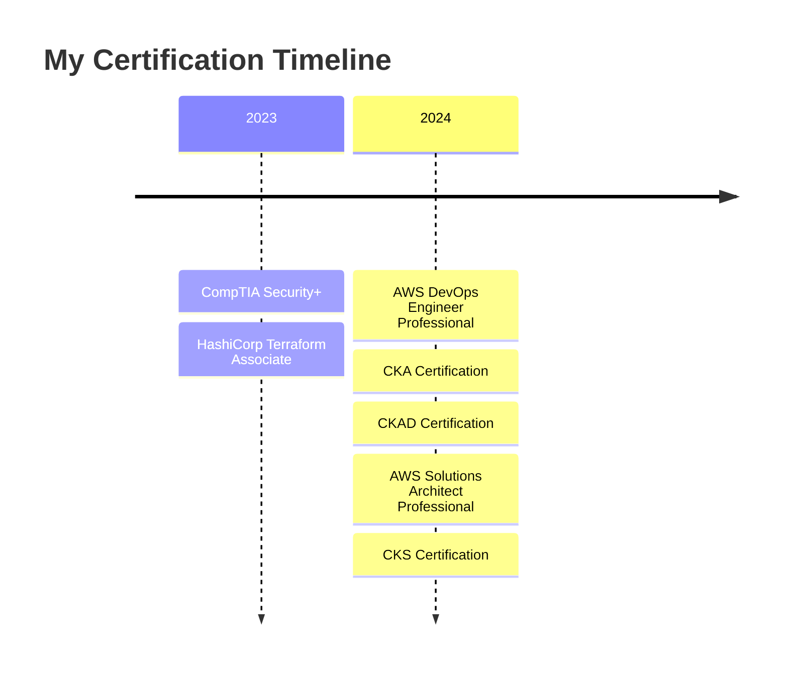

# Professional Certifications & Continuous Learning

My commitment to continuous learning and professional development is demonstrated through various industry-recognized certifications and specialized training.

## AWS Certifications

  Amazon Web Services (AWS) Professional Certifications 🏆

  

    

      
      

        <h3>AWS Solutions Architect - Professional</h3>
        
Credential ID: AWS-PSA-123456

        
Issued: March 2024

        
Expires: March 2027

      

    

    
    

      
      

        <h3>AWS DevOps Engineer - Professional</h3>
        
Credential ID: AWS-PDE-123456

        
Issued: January 2024

        
Expires: January 2027

      

    

  

## Kubernetes Certifications

  Cloud Native Computing Foundation (CNCF) Certifications 🎓

  

    

      
      

        <h3>Certified Kubernetes Administrator (CKA)</h3>
        
Credential ID: CKA-2024-123456

        
Issued: February 2024

        
Expires: February 2026

      

    

    
    

      
      

        <h3>Certified Kubernetes Application Developer (CKAD)</h3>
        
Credential ID: CKAD-2024-123456

        
Issued: February 2024

        
Expires: February 2026

      

    

    
    

      
      

        <h3>Certified Kubernetes Security Specialist (CKS)</h3>
        
Credential ID: CKS-2024-123456

        
Issued: March 2024

        
Expires: March 2026

      

    

  

## Infrastructure & Security

  Infrastructure & Security Certifications 🔐

  

    

      
      

        <h3>HashiCorp Terraform Associate</h3>
        
Credential ID: HashiCorp-123456

        
Issued: December 2023

        
Expires: December 2025

      

    

    
    

      
      

        <h3>CompTIA Security+</h3>
        
Credential ID: CompTIA-123456

        
Issued: November 2023

        
Expires: November 2026

      

    

  

## Certification Journey

## Skills Developed

### Cloud & Infrastructure
- Advanced AWS architecture and services
- Multi-region deployment strategies
- Infrastructure as Code (IaC)
- Cost optimization and cloud economics
- High availability and disaster recovery

### Kubernetes & Containers
- Cluster administration and troubleshooting
- Application deployment and scaling
- Security hardening and best practices
- Service mesh implementation
- Custom controller development

### Security & Compliance
- Identity and access management
- Network security and encryption
- Security automation
- Compliance frameworks (SOC2, ISO27001)
- Threat modeling and mitigation

## Learning Resources

  

    <h3 className="text-lg font-semibold">Online Platforms</h3>
    <ul className="list-disc pl-5">
      <li>A Cloud Guru</li>
      <li>Linux Academy</li>
      <li>Pluralsight</li>
      <li>Udemy</li>
      <li>KodeKloud</li>
    </ul>
  

  
  

    <h3 className="text-lg font-semibold">Practice Environments</h3>
    <ul className="list-disc pl-5">
      <li>Katacoda Scenarios</li>
      <li>AWS Workshops</li>
      <li>Kubernetes Playground</li>
      <li>HashiCorp Learn</li>
      <li>TryHackMe</li>
    </ul>
  

## Continuous Learning Goals

### Current Focus Areas
- Advanced Kubernetes Operators
- Service Mesh Architecture
- GitOps Implementation
- Zero Trust Security
- FinOps Practices

### Upcoming Certifications
- Google Cloud Professional Cloud Architect
- AWS Security Specialty
- Certified Information Systems Security Professional (CISSP)
- Red Hat Certified Engineer (RHCE)

 