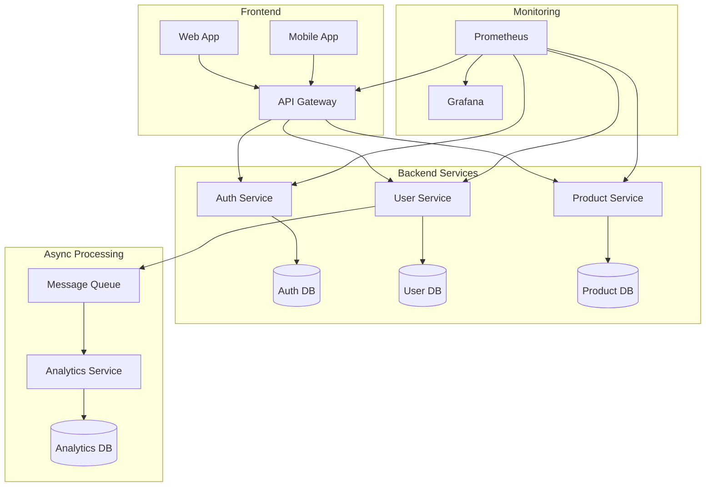
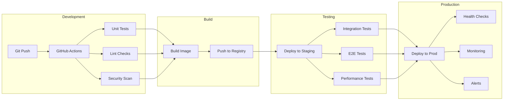
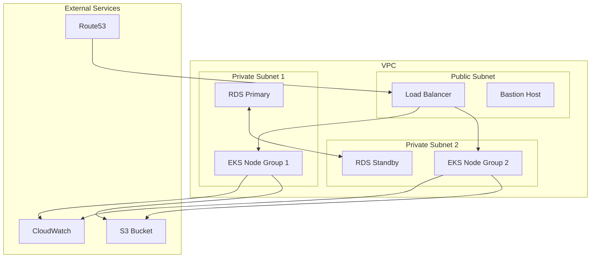
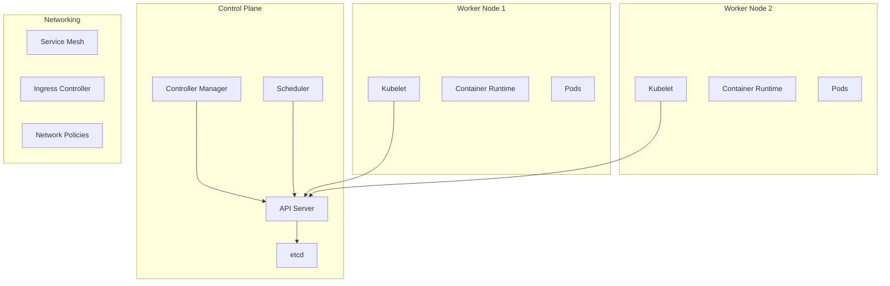
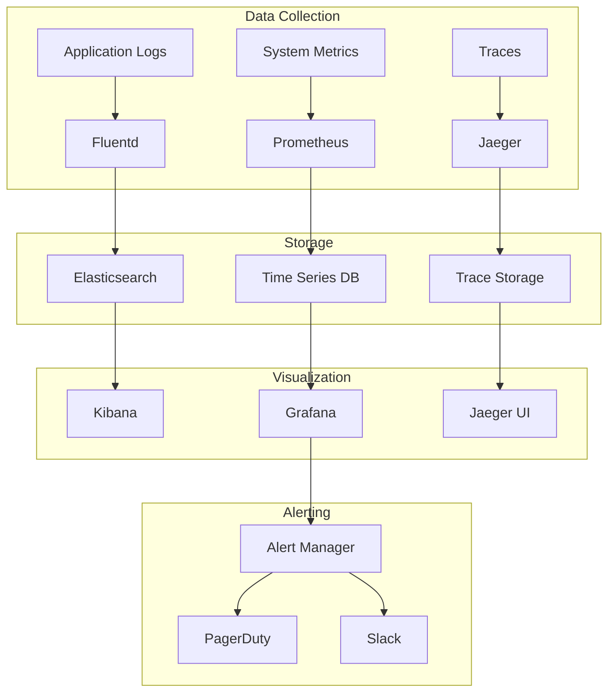
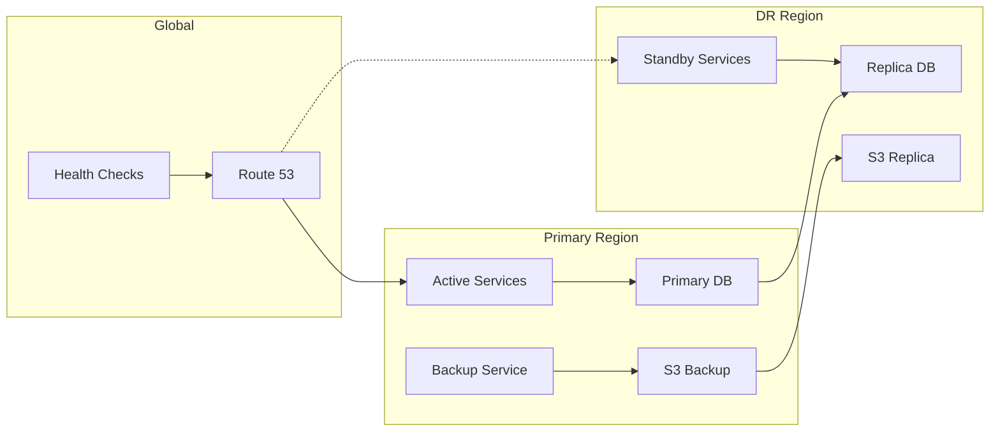
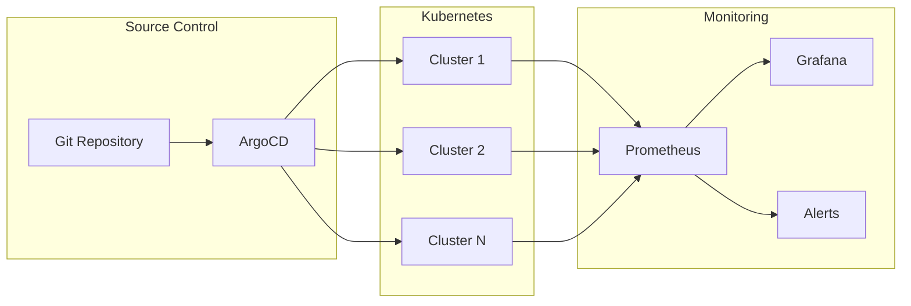
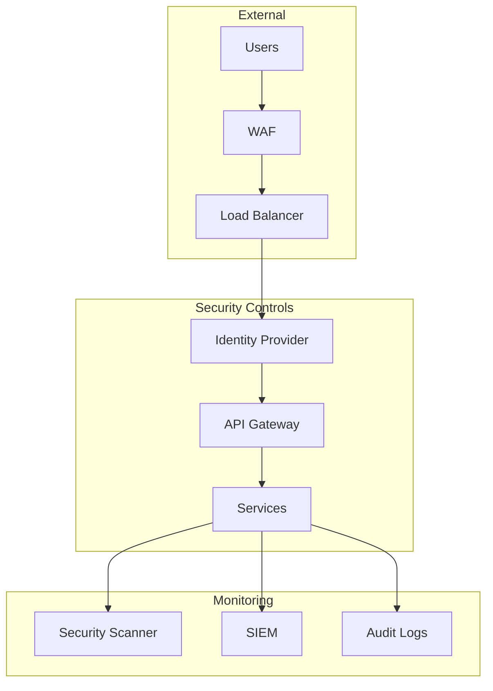

# System Architecture Diagrams: A Visual Guide to Modern Infrastructure

Visual documentation is crucial for understanding complex systems. In this post, I'll share various architecture diagrams that illustrate modern infrastructure patterns and workflows.

## Microservices Architecture

## CI/CD Pipeline Flow

## Cloud Infrastructure Blueprint

## Kubernetes Architecture

## Observability Stack

## Disaster Recovery Setup

## GitOps Workflow

## Security Architecture

## Best Practices for Architecture Diagrams

1. **Clarity First**
   - Use consistent shapes and colors
   - Group related components
   - Include clear labels and descriptions

2. **Level of Detail**
   - Match detail to audience
   - Layer diagrams (L1, L2, L3)
   - Include relevant metadata

3. **Maintenance**
   - Version control diagrams
   - Update with system changes
   - Document assumptions

## Tools and Resources

1. **Diagram Tools**
   - [Mermaid](https://mermaid-js.github.io/)
   - [Draw.io](https://draw.io)
   - [Excalidraw](https://excalidraw.com)

2. **Architecture Patterns**
   - [Cloud Design Patterns](https://docs.microsoft.com/azure/architecture/patterns/)
   - [AWS Architecture Center](https://aws.amazon.com/architecture/)
   - [Google Cloud Architecture Center](https://cloud.google.com/architecture)

3. **Standards**
   - [C4 Model](https://c4model.com/)
   - [ArchiMate](https://www.opengroup.org/archimate-forum)
   - [UML](https://www.uml.org/) 